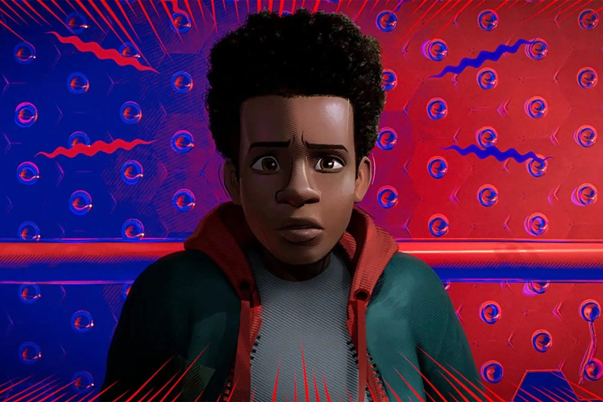
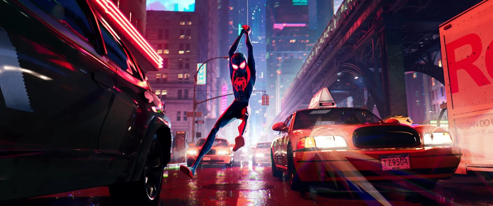
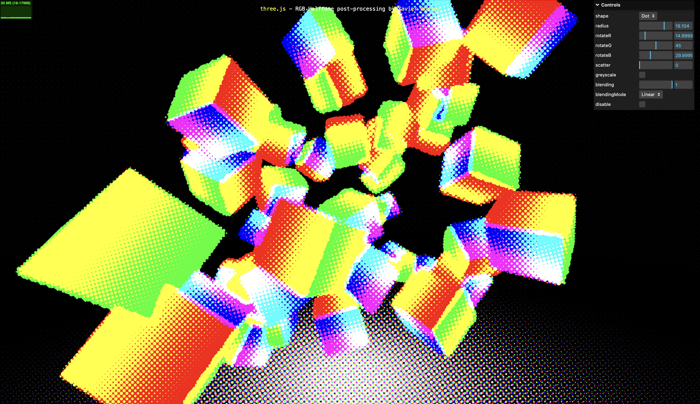

# IDEA9103_Test_GGbond

# Quiz 8 — Imaging & Coding Techniques

## Part 1 — Imaging Technique Inspiration (≤100 words)
Inspired by *Spider-Man: Into the Spider-Verse*, I aim for a hybrid 3D-to-2D comic look: quantized toon lighting, bold screen-space outlines, and RGB halftone dots, with occasional “animate on twos” cadence for graphic rhythm. This keeps 3D pipeline efficiency while achieving a hand-drawn aesthetic that supports readable silhouettes and strong color separation across screens. I’ll follow this breakdown for palette, outline strategy, and post-processing choices: https://www.postud.io/blog/spider-verse-breakdown/?utm_source=chatgpt.com

**Reference Stills**

---

## Part 2 — Coding Technique (≤100 words)
Use Three.js EffectComposer to add an RGB Halftone (noise-based dot) pass in post-processing, giving 3D frames a comic print texture. The effect runs in screen space, is lightweight, and layers easily over existing lighting. By tuning parameters like dot radius, angle, and scatter, I can control texture strength and readability per scene, achieving a Spider-Verse-style 3D→2D look.

**Demo / Example Code**
- Online demo (runs in browser):  
  https://threejs.org/examples/webgl_postprocessing_rgb_halftone.html
- Demo HTML (GitHub source):  
  https://github.com/mrdoob/three.js/blob/f6dba2558904dfbb54e6eb87db4ab0a9fae2c8d8/examples/webgl_postprocessing_rgb_halftone.html

**Source files (for reference)**
- HalftonePass.js — `examples/jsm/postprocessing/HalftonePass.js`  
- HalftoneShader.js — `examples/jsm/shaders/HalftoneShader.js`

**Technique Screenshot**

